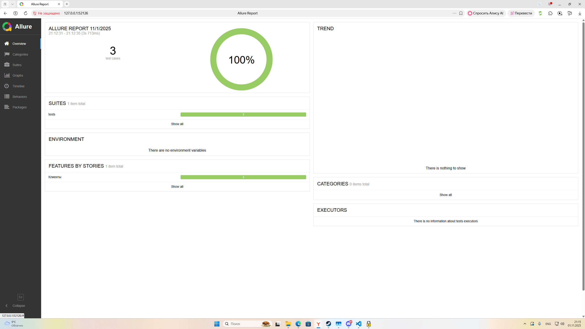
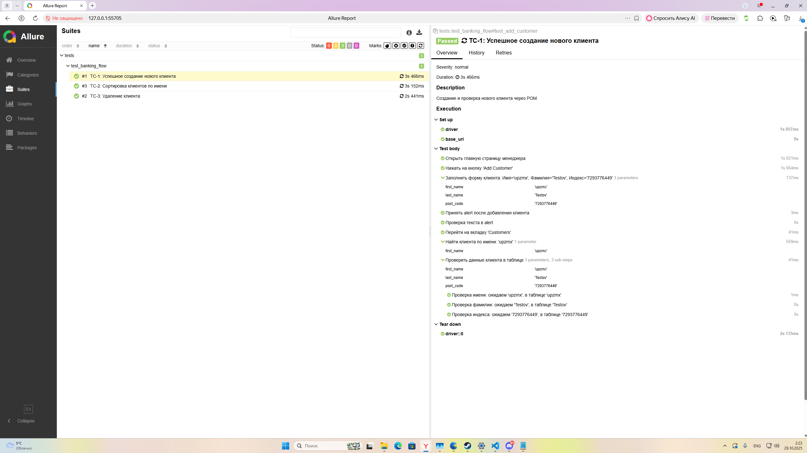
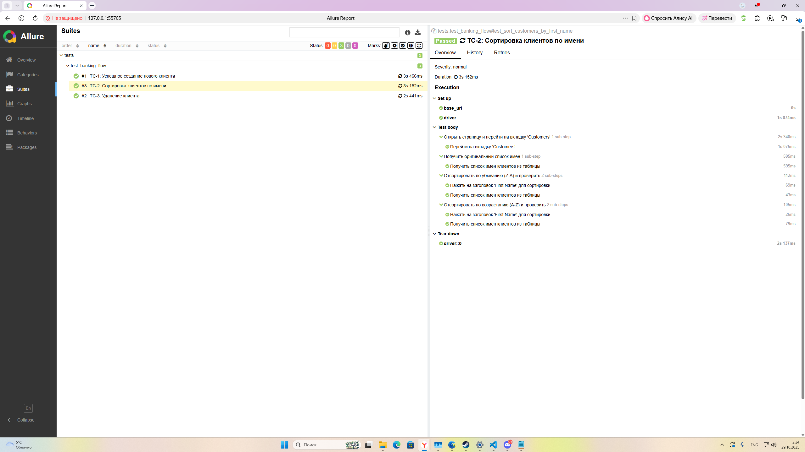
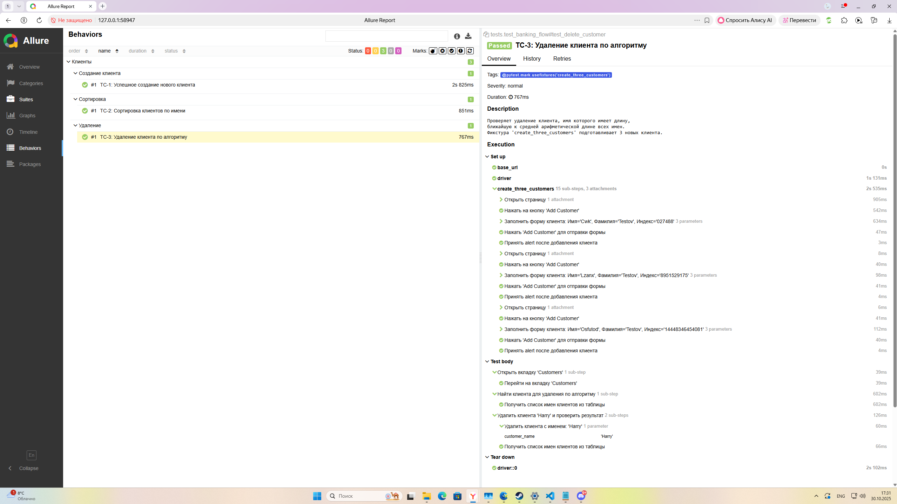

# Проект по автоматизации UI-тестов (Практикум SimbirSoft SDET)


Этот проект — мое решение практического задания по UI-автоматизации. В нем реализованы 3 автотеста для веб-приложения "XYZ Bank", покрывающие основной функционал.

---

### 🛠️ Стек технологий

*   **Python 3.10** — язык программирования.
*   **Pytest** — фреймворк для запуска тестов.
*   **Selenium** — библиотека для управления браузером.
*   **Allure Pytest** — для генерации детализированных отчетов.
*   **Pytest-xdist** — для параллельного выполнения тестов.
*   **GitHub Actions** — для автоматизации запуска тестов (CI/CD).
*   **Black & flake8** — для линтинга и форматирования кода.

---

### 🚀 Начало работы

#### Предусловия
- Установленный Python (версии 3.10+)
- Установленный Git
- Установленный Allure Commandline (для просмотра отчетов)

#### Установка и запуск

1.  **Клонируйте репозиторий:**
    ```shell
    git clone https://github.com/l-calax-l/sdet_practicum_ui.git
    cd sdet_practicum_ui
    ```

2.  **Настройте окружение:**
    *   Создайте файл `.env`, скопировав из шаблона `.env.example`.
    *   На Windows это можно сделать командой: 
    ```shell
    copy .env.example .env`
    ```

3.  **(Рекомендуется) Создайте и активируйте виртуальное окружение:**
    ```shell
    py -m venv venv
    .\venv\Scripts\activate
    ```

4.  **Установите зависимости:**
    ```shell
    py -m pip install -r requirements.txt
    ```
#### Запуск тестов

*   **Стандартный запуск (в один поток):**
    ```shell
    py -m pytest --alluredir=allure-results
    ```

*   **Параллельный запуск (например, в 3 потока):**
    ```shell
    py -m pytest -n 3 --alluredir=allure-results
    ```

#### Просмотр отчета Allure
*Результаты тестов автоматически сохраняются в папку `allure-results`.*
```shell
allure serve allure-results
```
---

### 🔄 CI/CD

В проект интегрирован CI-пайплайн с помощью **GitHub Actions**, который служит автоматическим "стражем качества".

### CI2: Настройка отчетов Allure
В проекте выполнена генерация отчетов в Jenkins.

---

### 📊 Отчет о тестировании Allure

Ниже представлены примеры сгенерированного отчета Allure, демонстрирующие как общий результат, так и детализации выполнения тест-кейсов.

<details>
  <summary><strong>📈 Обзор выполнения тестов (кликни, чтобы развернуть)</strong></summary>
  
  
</details>

<details>
  <summary><strong>📄 Детализация тест-кейса TC-1 (кликни, чтобы развернуть)</strong></summary>
  
  
</details>

<details>
  <summary><strong>📄 Детализация тест-кейса TC-2 (кликни, чтобы развернуть)</strong></summary>
  
  
</details>

<details>
  <summary><strong>📄 Детализация тест-кейса TC-3 (кликни, чтобы развернуть)</strong></summary>
  
  
</details>

---
**Автор:** Салихов Ильяс